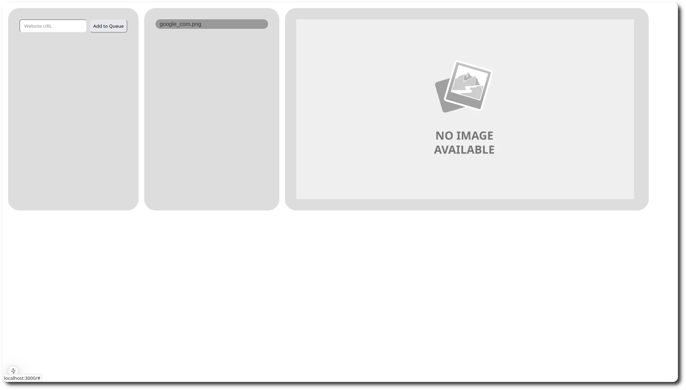
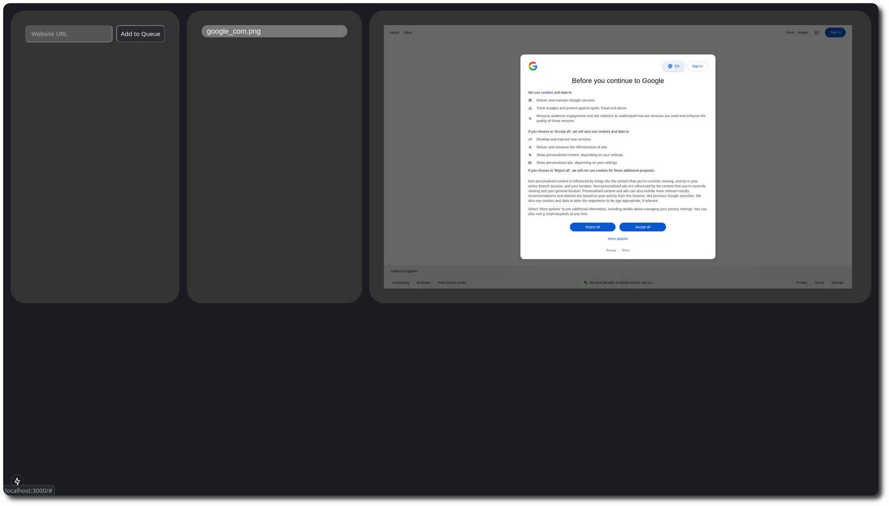

# Next.js Redis Puppeteer Screenshot Capture Tool

 
 


A service for capturing screenshots of websites using **Next.js**, **Redis**, and **Puppeteer**. Redis is used for job queue management, and a Next.js backend worker processes the queue to take screenshots with Puppeteer.

## Features

- 🗂️ Job queue management with Redis
- 📸 Website screenshot capture using Puppeteer
- 🛠️ Simple API to add URLs to the job queue
- 🔄 Job processing in the backend using Next.js

## Screenshots





## Usage

1. **Add a URL to the job queue**  
   You can add URLs for screenshot capture through the front-end interface. The URL will be added to the Redis job queue and will be processed by the backend worker.

   - The front-end makes a **POST** request to `/api/add-to-queue` with the URL to be captured. 
     - Example request body:  
      ```json
       { "url": "https://example.com" }
      ```
     - Example response:  
      ```json
       { "success": true, "queue": ["https://example.com", "https://earlier.example.com"] }
      ```

2. **Get the screenshot**  
   After the job is processed, you can view the screenshot directly on the front-end. The back-end stores images in the path specified in the .env file.
   By default this is expected to be the path to the /public folder so Next will allow viewing without extra configuration.

## Acknowledgements

- [Next.js](https://nextjs.org/)
- [Redis](https://redis.io/)
- [Puppeteer](https://pptr.dev/)
