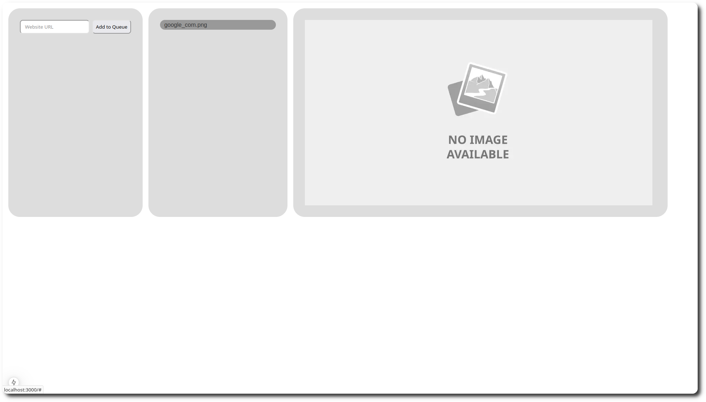

# Next.js Redis Puppeteer Screenshot Capture Tool

 
 


A service for capturing screenshots of websites using **Next.js**, **Redis**, and **Puppeteer**. The project also leverages **React Query** for efficient state management and server-side data synchronization. Redis is used for job queue management, and a Next.js backend worker processes the queue to take screenshots with Puppeteer.

## Features

- 🗂️ Job queue management with Redis
- 📸 Website screenshot capture using Puppeteer
- ⚡ Real-time UI updates using React Query
- 🛠️ Simple API to add URLs to the job queue
- 🔄 Job processing in the backend using Next.js

## React Query Integration

This project uses **React Query** for seamless server-side data fetching and caching. It ensures that the application remains responsive and up-to-date by synchronizing the state with the server in real-time. Key benefits include:

- Automatic cache management
- Optimistic updates for instant feedback
- Real-time refetching of queue and results data

## Screenshots




## Usage

1. **Add a URL to the job queue**  
   You can add URLs for screenshot capture through the front-end interface. The URL will be added to the Redis job queue and will be processed by the backend worker.

   - The front-end makes a **POST** request to `/api/add-to-queue` with the URL to be captured. 
     - Example request body:  
       ```json
       { "url": "https://example.com" }
       ```
     - Example response:  
       ```json
       { "success": true, "queue": ["https://example.com", "https://earlier.example.com"] }
       ```

2. **Real-time Updates with React Query**  
   React Query ensures that the job queue and results are updated in real time. After a URL is submitted, the queue is updated optimistically, and the processed results are automatically fetched.

3. **Get the screenshot**  
   After the job is processed, you can view the screenshot directly on the front-end. The back-end stores images in the path specified in the `.env` file. By default, this is expected to be the `/public` folder, so Next.js allows viewing without extra configuration.

## Acknowledgements

- [Next.js](https://nextjs.org/)
- [Redis](https://redis.io/)
- [Puppeteer](https://pptr.dev/)
- [React Query](https://react-query.tanstack.com/)
